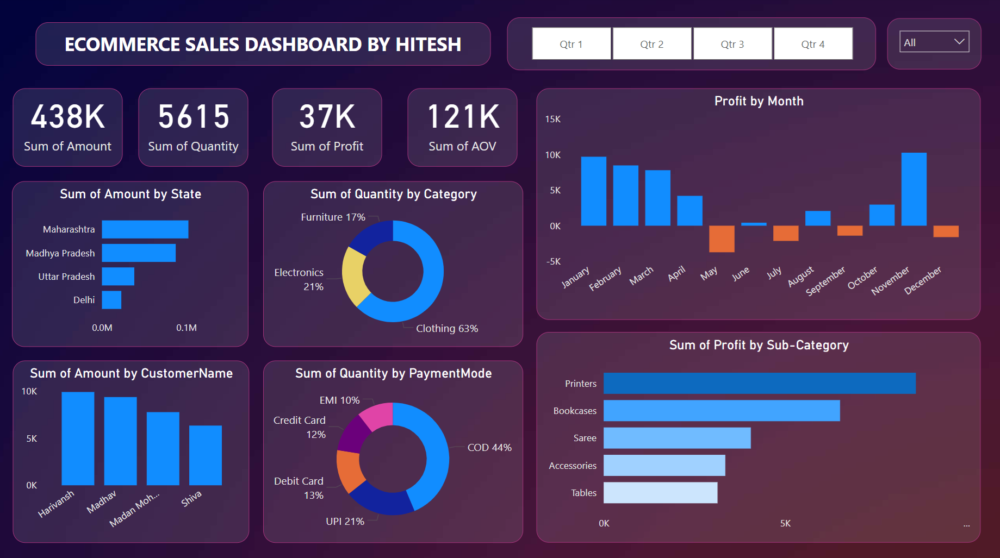

# Ecommerce Sales Analysis using Power BI

This project involves the analysis of ecommerce sales data using Power BI. The goal is to provide insights into sales performance, customer behavior, and profitability through interactive and visually appealing dashboards.

## Overview

The Power BI dashboard provides a comprehensive view of ecommerce sales data, including metrics such as total sales amount, quantity sold, profit, and average order value (AOV). The dashboard also offers insights into sales distribution by state, customer, category, payment mode, and sub-category.

## Key Metrics

- **Total Sales Amount**: 438K
- **Total Quantity Sold**: 5615
- **Total Profit**: 37K
- **Average Order Value (AOV)**: 121K

## Visualizations

1. **Sales Amount by State**: Shows the distribution of sales across different states, with Maharashtra leading, followed by Madhya Pradesh and Uttar Pradesh.

2. **Quantity Sold by Category**: A pie chart displaying the percentage distribution of quantity sold across different product categories. Clothing accounts for 63%, Electronics 21%, and Furniture 17%.

3. **Profit by Month**: A bar chart illustrating monthly profit trends, highlighting peaks and troughs in profitability throughout the year.

4. **Sales Amount by Customer Name**: A bar chart showing the sales amount contributed by top customers.

5. **Quantity Sold by Payment Mode**: A pie chart representing the percentage of quantity sold via different payment modes, with Cash on Delivery (COD) at 44%, UPI at 21%, Debit Card at 13%, Credit Card at 12%, and EMI at 10%.

6. **Profit by Sub-Category**: A bar chart depicting the profit generated by different sub-categories, with Printers leading, followed by Bookcases, Sarees, Accessories, and Tables.

## Filters

The dashboard includes filters for different quarters (Qtr 1, Qtr 2, Qtr 3, Qtr 4) and the option to view data for all quarters. This allows users to drill down and analyze performance for specific time periods.

## Conclusion

The Power BI dashboard provides valuable insights into ecommerce sales performance, helping stakeholders make informed decisions. By analyzing key metrics and visualizations, businesses can identify trends, understand customer preferences, and optimize their strategies for improved profitability.

## How to Use

1. Open the Power BI file (.pbix) with Power BI Desktop.
2. Refresh the data source to load the latest ecommerce sales data.
3. Use the interactive filters to explore the data across different dimensions.
4. Analyze the visualizations to gain insights into sales performance, customer behavior, and profitability.

## License

This project is licensed under the MIT License. See the [LICENSE](LICENSE) file for details.

## References

- [Power BI Documentation](https://docs.microsoft.com/en-us/power-bi/)
- [Ecommerce Sales Data](https://www.kaggle.com/datasets/thedevastator/unlock-profits-with-e-commerce-sales-data)
- [Data Visualization Best Practices](https://www.tableau.com/learn/articles/data-visualization-best-practices)

